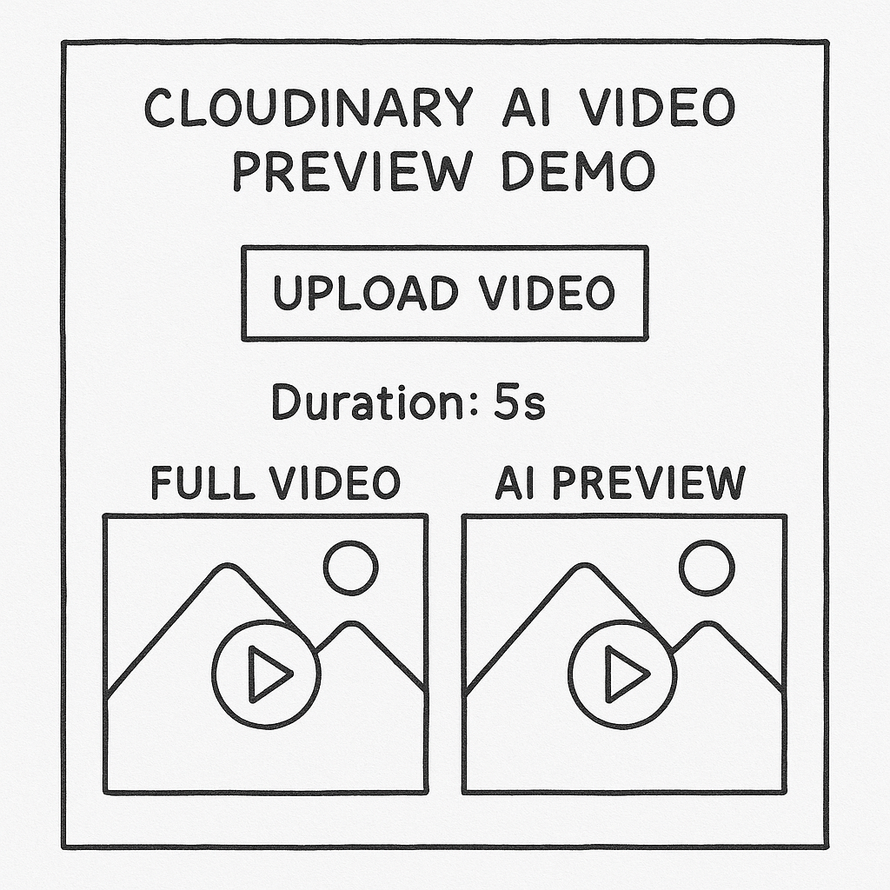

# 🎬 Cloudinary AI Video Preview Demo

> A modern demo app to generate smart video previews using Cloudinary AI.



---

## ✨ Features

- Upload a video
- Instantly generate AI-based smart previews via **Cloudinary AI**
- Adjustable preview duration (e.g., 5s, 8s, 10s)
- Side-by-side comparison: Full video vs Preview
- Built with **Next.js 15**, **Tailwind CSS 4**, **shadcn/ui**, and **Motion.dev**

---

## 🛠 Built With

[](https://nextjs.org/)
[](https://cloudinary.com/)
[](https://tailwindcss.com/)
[](./LICENSE)

---

## 📚 Table of Contents

- [Prerequisites](#prerequisites)
- [Local Setup](#local-setup)
- [.env Configuration](#env-configuration)
- [Available Scripts](#available-scripts)
- [Deploying](#deploying)
- [Useful Links](#useful-links)

---

## ✅ Prerequisites

- **Node.js 18+** (tested on Node 20)

```bash
nvm install 20
nvm use 20
```

- A free [Cloudinary](https://cloudinary.com/) account  
  → Get your **Cloud Name**, **API Key**, and **API Secret**

---

## 🚀 Local Setup

```bash
# 1. Clone the repo
git clone https://github.com/musebe/nextjs-cloudinary-ai-video-previews.git
cd nextjs-cloudinary-ai-video-previews

# 2. Install dependencies
npm install  # or pnpm / yarn / bun

# 3. Add environment variables
cp .env.example .env.local
#    → Paste your Cloudinary keys inside .env.local

# 4. Run the dev server
npm run dev
#    → Visit http://localhost:3000
```

---

## ⚙️ .env Configuration

Create a `.env.local` file with the following:

| Key                                 | Example             | Description                          |
|-------------------------------------|---------------------|--------------------------------------|
| `NEXT_PUBLIC_CLOUDINARY_CLOUD_NAME` | `my-cloud`          | Public Cloudinary cloud name         |
| `CLOUDINARY_API_KEY`                | `123456789012345`   | API Key (server-side)                |
| `CLOUDINARY_API_SECRET`             | `s0m3-sup3r-s3cr3t` | API Secret (server-side)             |

> ⚠️ `.env.local` is gitignored — your secrets stay safe.

---

## 📜 Available Scripts

| Command                   | Description                            |
|---------------------------|----------------------------------------|
| `npm run dev`             | Start local dev server                 |
| `npm run build`           | Build the app                          |
| `npm run start`           | Run production server                  |
| `npm run lint`            | Run ESLint and TypeScript checks       |

---

## 🌍 Deployment

This project is Vercel-ready:

1. Push to GitHub
2. Import into [vercel.com](https://vercel.com/)
3. Add your environment variables
4. Deploy and watch the magic 🎥✨

Also works great on **Netlify** or **Render**.

---

## 🔗 Useful Links

- 📘 [AI-Based Video Preview Docs](https://cloudinary.com/documentation/video_effects_and_enhancements#ai_based_video_preview)
- 🧠 [Next.js Image and Video Optimization](https://nextjs.org/docs/app/building-your-application/optimizing/images)
- 💫 [Motion.dev](https://motion.dev)
- 🛠 [shadcn/ui](https://ui.shadcn.com)


TODO 

Upload Button Component - Popup Card 
Upload Stream progress bar 